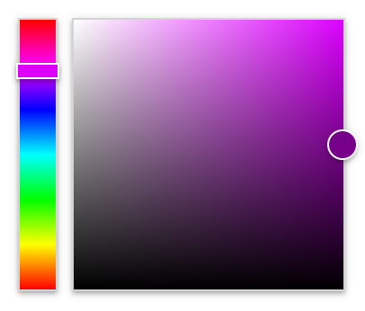
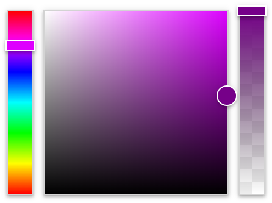
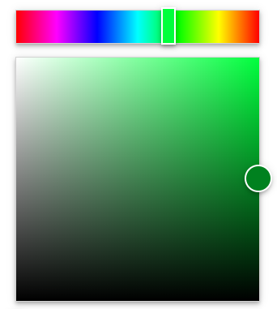
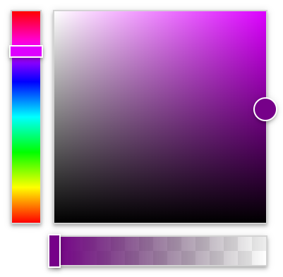
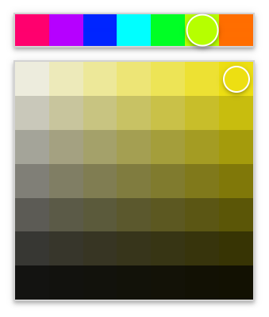
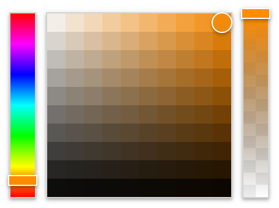
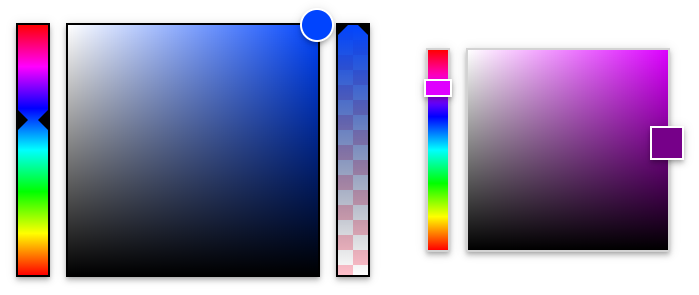

# colorex

Engine of color picker which you can use to create a component in any javascript framework.

[Live demo](https://exnext.github.io/colorex/demo/)

## Start in your website

```html
<link href="colorex.css" rel="stylesheet">
<script type='text/javascript' src='colorex.js'></script>
```

## Create a simple component

Example from below presents a code to create a simple component with rainbow and gradient pickers.

```js
let config = {
    picker: '#picker1'
};

let colorpicker = new colorex(config);
```

```html
<div id="picker1"></div>
```

<p align="center">
    
</p>

## Set and get color

Each object of colorex has property, which we can use to set and get color value. Setter allows any html type which presents color. Getter return only hexadecimal value.

```js
colorpicker.color = 'red';
colorpicker.color = '#00ff00';
colorpicker.color = 'rgb(0, 0, 255)';

let color = colorpicker.color; //#0000ff
```

## Create a component with alphablend detail

Adding an alphablend field with the value set to true, we create colorex component with alpha blend picker. Getter of the color property return hexadecimal value with alpha level.

```js
let config = {
    picker: '.picker2',
    alphablend: true
};

let colorpicker = new colorex(config);

colorpicker.color = '#00ff007f';
colorpicker.color = 'rgb(0, 0, 255, 0.5)';

let color = colorpicker.color; //#0000ff7f
```

<p align="center">
    
</p>

## Initial color

Create component with initial value of the color if default color should not be visible on the start.

```js
let config = {
    picker: document.getElementById("picker3"),
    color: '#760089'
};

let colorpicker = new colorex(config);

let color = colorpicker.color;
```

## Events

All click events on each picker evokes onChange event. Its argument has included new value of color, which can also be read from color field of colorex component.

```js
let config = {
    picker: document.querySelector('#picker4'),
    onChange: (result) => {
        let color = result.color;
    }
};

let colorpicker = new colorex(config);
```

## Horizontal pickers

Adding a horizontal field with the value set to true, we can change rainbow and alphablend pickers orientation.

```js
let config = {
    picker: document.querySelector('.picker5'),
    horizontal: true
};

let colorpicker = new colorex(config);
```

<p align="center">
    
</p>

## Horizontal custom pickers

Changes orientation is possible for selected picker. You have to build yours own DOM for component and indicate each element of colorex component. Possible is indicate elements by class, id, object of element or any selectors.

```js
let config = {
    picker: {
        rainbow: '#rainbow',
        gradient: document.getElementById('gradient'),
        alpha: document.querySelector('.alpha')
    },
    horizontal: { rainbow: false, alpha: true }
    // horizontal: { alpha: true }
};

let colorpicker = new colorex(config);
```

Below is example DOM of component and extend colorex class in CSS. Class of colorex is necesaty on main element, but you can added new classes with overrited styles values. If you don't set it, your component may does not look well.

```html
<div class="colorex">
    <div>
        <div id="rainbow"></div>
        <div id="gradient"></div>
    </div>
    <div class="alpha"></div>
</div>
```

```css
.colorex *:not(.alpha) {
    display: flex;
}

.colorex {
    flex-direction: column;
    align-items: flex-end;
}
```

<p align="center">
    
</p>

## Pixelation

The pixelize is feature with step draw color on pickers and step changing values on them. Pixelize field with the value set to 0 work like configuration without pixalize field.

```js
let config = {
    picker: '.picker6',
    alphablend: true,
    pixelize: 10
};

let colorpicker = new colorex(config);
```

<p align="center">
    
</p>

## Pixelization selected element

Similar to horizontal custom element, user can customize all pickers separately. On this situation own DOM for component is not necessary.

```js
let config = {
    picker: '.picker6',
    pixelize: { gradient: 10 }
    // pixelize: { gradient: 10, alphablend: 0 }
    // pixelize: { rainbow: 20, gradient: 10, alphablend: 14 }
};

let colorpicker = new colorex(config);
```

<p align="center">
    
</p>

## Customize style

To personalize layout of all component you should override style of css. You can look to file [colorex.css](./dist/colorex.css) which style you need do override. You can also presonalize layout by overrided below variabes which are predefined and used in [colorex.css](./dist/colorex.css).

```css
.colorex {
    --border-width: 2px;
    --space-between: 16px;
    --gradient-selector-size: 30px;
    --gradient-size: 300px;
    --picker-selector-size: 14px;
    --picker-size: 40px;
    --alpha-background: #eeeeee;
}
```

<p align="center">
    
</p>